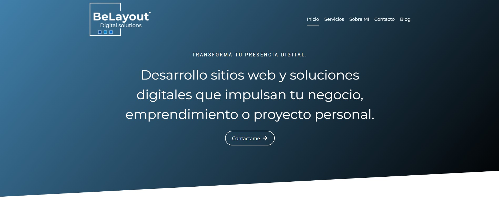
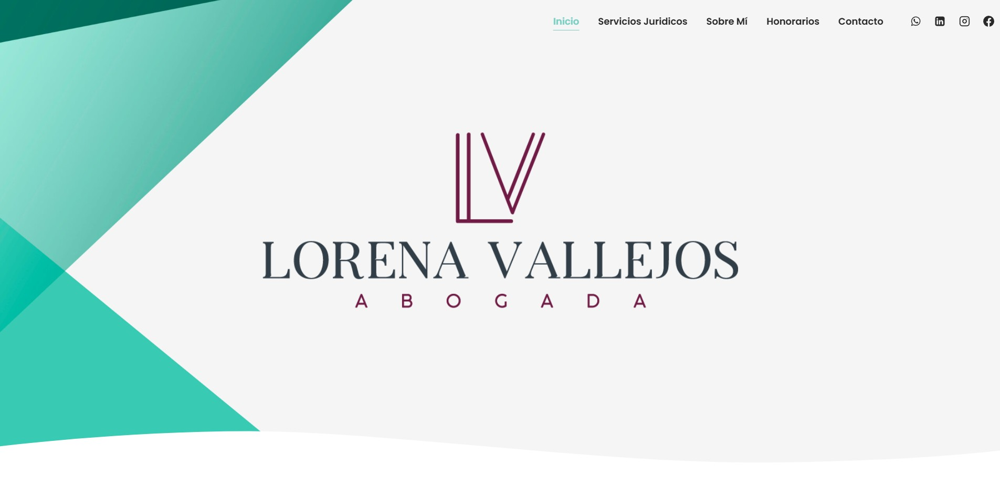
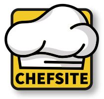
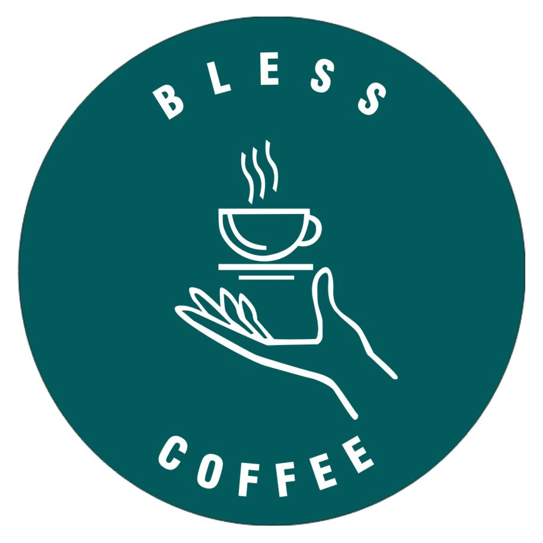
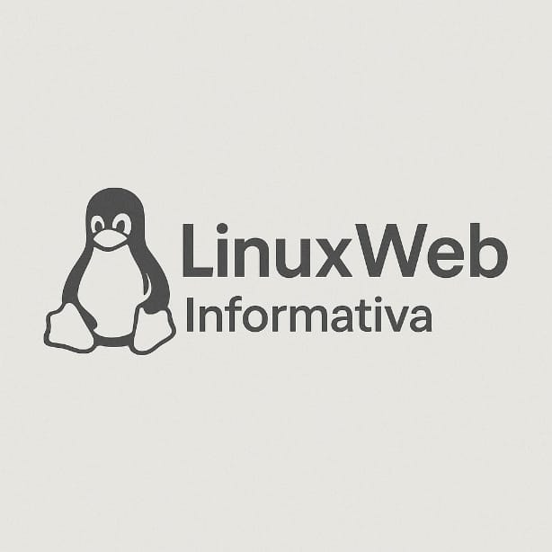

<h1 align="center"> Hi 👋 I'm Lucas Bonadies ✨ </h1> 
<h2 align="center">🎓 Software Development Technician 🎓</h2> 

 
<h2> About Me <picture></picture> </h2>
<!--Intro start-->

I am the creator of **BeLayout**, a brand dedicated to software development and custom web design.
I am passionate about transforming ideas into functional and visually compelling applications, working with modern technologies tailored to each client.
  
I am proactive, organized, and responsible 📚, with excellent interpersonal skills and 3 years of experience in software development 💻. I stand out for my ability to work in teams, make decisions, and quickly adapt to new challenges ☺️. In one of the projects I worked on, I had the privilege of being a leader 📝; this allowed me to develop effective communication, foster collaboration, and make strategic decisions under pressure.

**Contact**:

<!--Intro end-->
  

 

<h2 > Technologies I use as a Developer 🛠️ </h2>
<!--tech stack icons-->

  

 
<!-------------------------->
<h2 > Technologies I’m currently learning 👨🏻‍💻</h2>
<!--tech stack icons-->

  

 
<!-------------------------->

  
  <h2 > Some Projects 🔥</h2>
  
  - 💼 [BeLayout Website](https://belayout.com/)  
  - ☕ [BlessCoffee - Management system for cafes.](https://github.com/lucasbonadies/BlessCoffee)  
  - 🍽️ [ChefSite - Comprehensive restaurant system](https://github.com/lucasbonadies/ChefSite)  
  - 🐧 [LinuxWeb - Informational website about Linux](https://github.com/lucasbonadies/LinuxWeb)
  
---

  
  
  

  
  
  

--- 

 

<h2> GitHub :octocat: </h2>
<!--- stats & Trophy (start) -->

  <!--- stats (start) -->
<table align="left">
<tr border="none">
<td width="60%" align="center">
  
 
     
</td>

<td width="40%" align="center">

  

  </td>
</tr>
</table>
<!--- stats (end) -->

<!--- trophy (start) -->

  

<!--- trophy (start) -->

        
<!--- stats (end) --> 

---

<h2> Social networks </h2>

  
  
    
  
  
  

✨ **Thanks for visiting my profile!**

 I'm always open to new opportunities, collaborations, and creative challenges. 🚀

