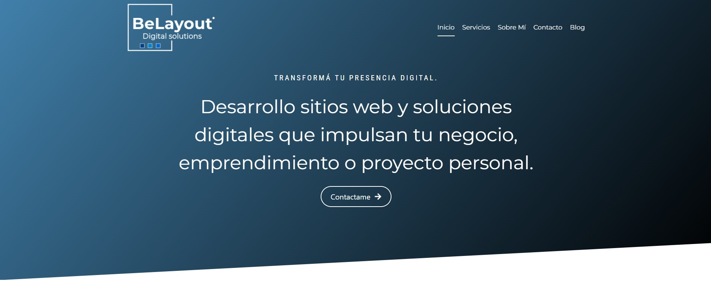
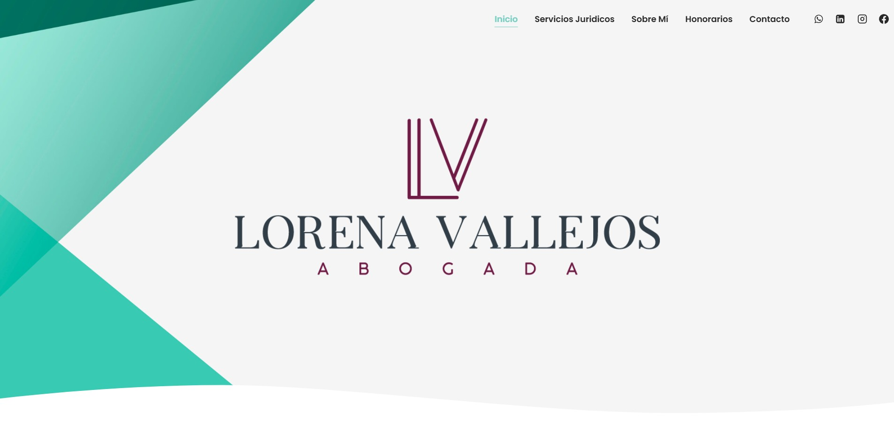
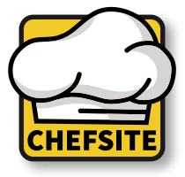
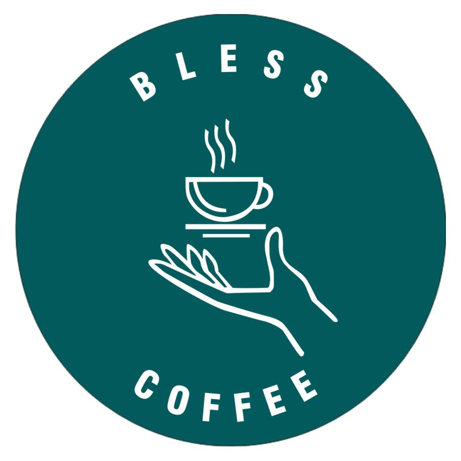
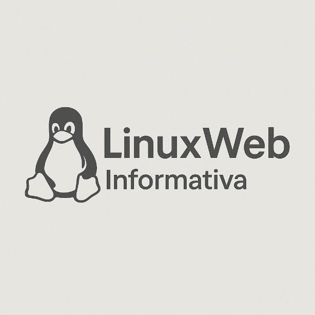

<h1 align="center">Hi 👋 I'm Lucas Bonadies</h1>
<h3 align="center">Web Developer focused on business-oriented applications & digital solutions</h3>

---

## 🧠 About Me

I’m the creator of **BeLayout**, a brand focused on building custom web solutions for real businesses.

I work on both:
- Custom web applications (PHP, MySQL)
- Scalable implementations using WordPress

My approach is practical: design and develop systems that solve real operational problems, improve workflows, and deliver measurable value.

---

## 💼 Experience

- +6 professional WordPress websites (business & institutional)
- Custom management systems for restaurants and cafes
- Web applications focused on operations, reporting, and client management

> Some projects are private due to client agreements.

---

## 🛠️ Tech Stack

  

---

## 🚀 Projects

- 💼 [BeLayout Website](https://belayout.com/)  
- ☕ [BlessCoffee – Café management system](https://github.com/lucasbonadies/BlessCoffee)  
- 🍽️ [ChefSite – Restaurant management system](https://github.com/lucasbonadies/ChefSite)  
- 🐧 [LinuxWeb – Informational Linux website](https://github.com/lucasbonadies/LinuxWeb)

---

## 🌐 Portfolio Preview

  
  
  

  
  
  

---

## 📊 GitHub Stats

  

  

---

## 🌐 Contact

  
   
  
   
  

---

  

---

Focused on building scalable web solutions and continuously improving development workflows.

